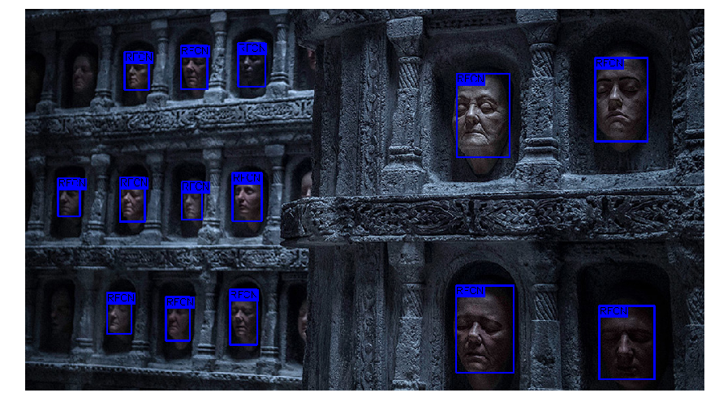
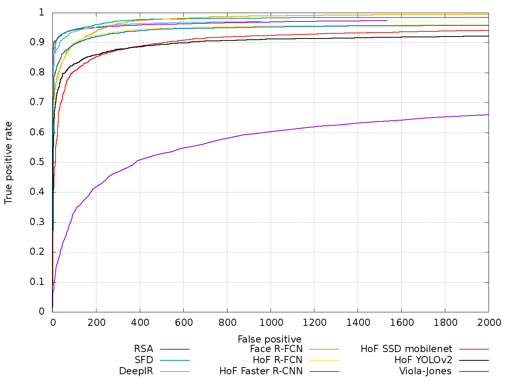
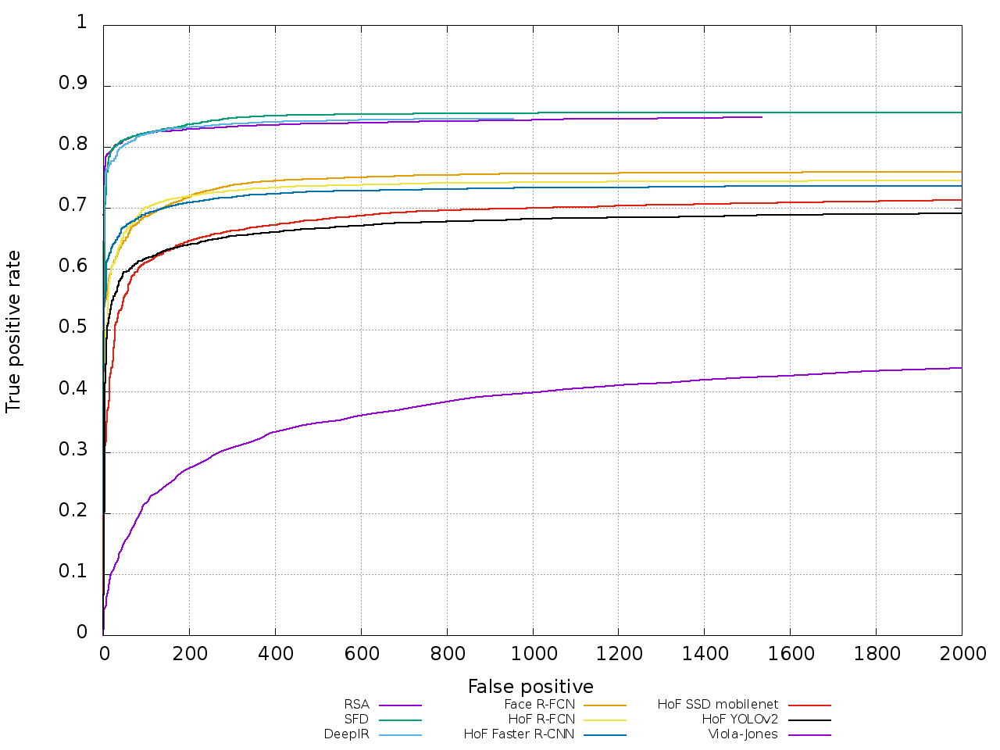

# Hall of Faces: a face detection model zoo

 

A collection of face detection models pre-trained on the [Widerface](http://mmlab.ie.cuhk.edu.hk/projects/WIDERFace/) 
dataset. 

In the table below you can see each model detailed information including:

* meta architecture name
* model speed 
* detector performance measured on the [FDDB](http://vis-www.cs.umass.edu/fddb/) benchmark
* a download link to a `tar.gz` file containing the model and configuration files
* a link for a live demo running on a [Google Colaboratory](https://colab.research.google.com/) notebook

Architecture | Speed (ms) | mAP@0.5 | Cfg/Weights | Demo
--- | ---: | ---: | :---: | :---:
R-FCN resnet101 | 92 | 94.73 | [link](https://drive.google.com/open?id=1is7Ldv9ASYNcrv2GyXS7EaV58UaqhuFQ) | [colab](https://colab.research.google.com/drive/1lJWquGmKoMm68qNuwjSnfMjjIi-UTzI1#scrollTo=Zp3bGqX-GWd0)
Faster R-CNN inception resnet v2 atrous | 620 | 94.39 | [link](https://drive.google.com/open?id=1bMdKHMcVidrG7BUvoIk6cCcEGKhBFvcc) | [colab](https://colab.research.google.com/drive/1lJWquGmKoMm68qNuwjSnfMjjIi-UTzI1#scrollTo=6NV0LmOgG1v5)
SSD mobilenet v1 | 30 | 91.20 | [link](https://drive.google.com/open?id=1NT3PLBHa4cYj_RmKlRrCZSWMKMct2-26) | [colab](https://colab.research.google.com/drive/1lJWquGmKoMm68qNuwjSnfMjjIi-UTzI1#scrollTo=638fiFbQG7ue)
YOLOv2 | 15 | 84.90 | [link](https://drive.google.com/open?id=1_Uj59hkJEpht2ykZphW4m-l42odwkPJB) | [colab](https://colab.research.google.com/drive/1lJWquGmKoMm68qNuwjSnfMjjIi-UTzI1#scrollTo=gAN4lrmiQv6z)

## Face detectors performance **evaluation** on the FDDB dataset

### Discrete ROC

 

### Continuous ROC

 

## Training details

[Morghulis](https://github.com/the-house-of-black-and-white/morghulis) was used to 
download and convert it to either [Darknet](https://pjreddie.com/darknet/yolo/) or [Tensorflow Object Detection API](https://github.com/tensorflow/models/tree/master/research/object_detection) format.

### Tensorflow Object Detection API

The remaining models were trained with [Tensorflow Object Detection API](https://github.com/tensorflow/models/tree/master/research/object_detection) 
on [Google Cloud ML Engine](https://cloud.google.com/ml-engine/docs/technical-overview).

### Darknet

There are 2 models trained with [Darknet](https://pjreddie.com/darknet/yolo/): one based on YOLOv2 and other 
on Tiny YOLO. Both used convolutional weights that are pre-trained on Imagenet: 
[darknet19_448.conv.23](https://pjreddie.com/media/files/darknet19_448.conv.23).
